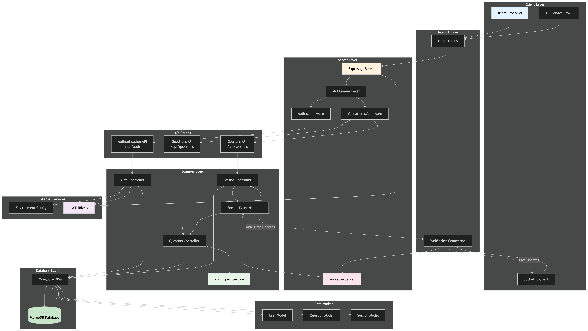
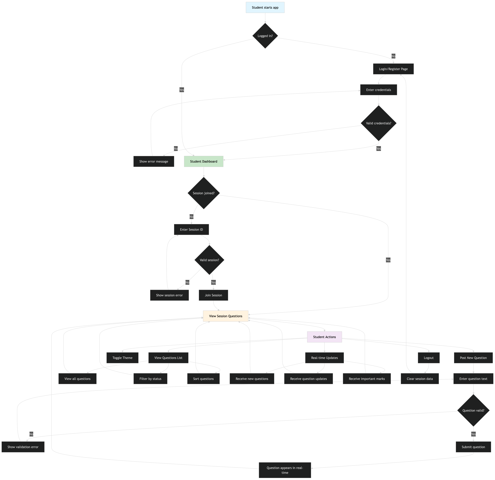

# VidyaVichara - Classroom Q&A Board

A real-time classroom Q&A application where students can post questions during lectures and instructors can view, organize, and respond to them in real-time.

Made with ❤️ by Team 25.

## Teacher's Dashboard


## Student's Dashboard


---

## Features

- **Real-time Q&A**: Students post questions instantly, teachers see them live
- **Session Management**: Teachers create and manage lecture sessions with human-readable IDs
- **Role-based Access**: Separate dashboards for students and teachers
- **Question Management**: Mark questions as important, answered, or delete them
- **PDF Export**: Teachers can export session summaries as PDF reports
- **Session Control**: Teachers can end sessions and clear questions
- **Real-time Updates**: Socket.io for instant synchronization across all users
- **Responsive Design**: Works seamlessly on mobile, tablet, and desktop
- **Dark/Light Theme**: Toggle between themes with ☀️/🌙 button

## 🛠️ MERN Stack Implementation

### Frontend (React + Vite)

- **React 18**: Modern functional components with hooks
- **Vite 5**: Fast development server with HMR and optimized builds
- **Tailwind CSS**: Utility-first CSS framework for rapid UI development
- **shadcn/ui**: High-quality component library built on Radix UI primitives
- **Socket.io Client**: Real-time bidirectional communication
- **React Router DOM**: Client-side routing and navigation
- **Zod**: Runtime type validation for forms and API responses

### Backend (Express + Node.js)

- **Express 4**: Minimal and flexible Node.js web framework
- **Socket.io 4**: Real-time engine with WebSocket fallback
- **Mongoose**: MongoDB object modeling for Node.js
- **JWT**: Stateless authentication with JSON Web Tokens
- **bcryptjs**: Password hashing with salt rounds
- **Helmet**: Security middleware for HTTP headers
- **CORS**: Cross-origin resource sharing configuration

### Database (MongoDB)

- **MongoDB 6+**: Document-oriented NoSQL database
- **Mongoose ODM**: Object document mapping with schema validation
- **Indexing**: Optimized queries for session and user data
- **Aggregation**: Complex queries for analytics and reporting

## 🎨 Design Decisions

### Architecture Patterns

- **RESTful API**: Clean separation between frontend and backend
- **Real-time Communication**: Socket.io for instant updates across clients
- **JWT Authentication**: Stateless auth for scalability
- **Component-based UI**: Reusable React components for maintainability

### Technical Choices

- **Human-readable Session IDs**: Format like `SCI-SEP26-001` for easy sharing
- **Role-based Authorization**: Middleware-based permissions (student/teacher)
- **Responsive Design**: Mobile-first approach with Tailwind breakpoints
- **Dark/Light Theme**: CSS variables with system preference detection
- **Error Boundaries**: Graceful error handling in React components
- **Input Validation**: Client-side and server-side validation with Zod

### Performance Optimizations

- **Socket.io Rooms**: Efficient real-time updates per session
- **Database Indexing**: Optimized queries for session and user lookups
- **Code Splitting**: Lazy loading with React.lazy and Suspense
- **Bundle Optimization**: Vite's automatic code splitting and tree shaking

## 🏗️ Architecture

- **Frontend**: React 18 + Vite 5 + Tailwind CSS + shadcn/ui
- **Backend**: Express 4 + Node.js 18+ + Socket.io 4
- **Database**: MongoDB 6+ with Mongoose ODM
- **Authentication**: JWT tokens with bcrypt password hashing
- **Validation**: Zod schemas for type-safe API contracts
- **Styling**: Mobile-first responsive design with CSS variables for theming

---

## How to get the project running (setup guide)

### 1. Clone and Install

```bash
# Install backend dependencies
cd backend
npm install

# Install frontend dependencies
cd ../frontend  
npm install
```

### 2. Environment Setup

**Backend Environment:**

```bash
cd backend
cp .env.example .env
# Edit .env with your MongoDB URI and JWT secret
```

**Frontend Environment:**

```bash
cd frontend
cp .env.example .env
# Edit .env if needed (defaults should work for local development)
```

### 3. Database Setup

Start MongoDB locally or ensure your MongoDB Atlas connection is ready. The application will automatically create the required collections.

```bash
# mongosh mongodb://localhost:27017/vidyavichara
```

### 4. Start the Application

**Start Backend (Terminal 1):**

```bash
cd backend
npm run dev
# Backend runs on http://localhost:3001
```

**Start Frontend (Terminal 2):**

```bash
cd frontend  
npm run dev
# Frontend runs on http://localhost:5173
```

### 5. Use the Application

1. Open <http://localhost:5173> in your browser
2. Register as either a Student or Teacher
3. **Students**: Submit questions for your lecture session
4. **Teachers**: Load a session to view and manage questions in real-time

## Solution Diagram



## User Flows

### Teacher


### Student


