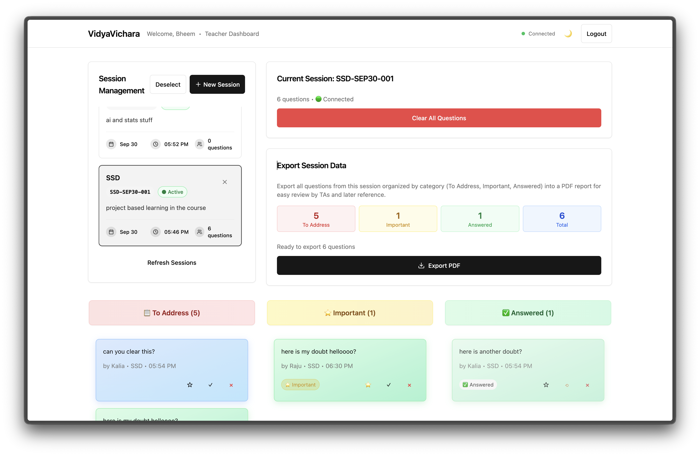
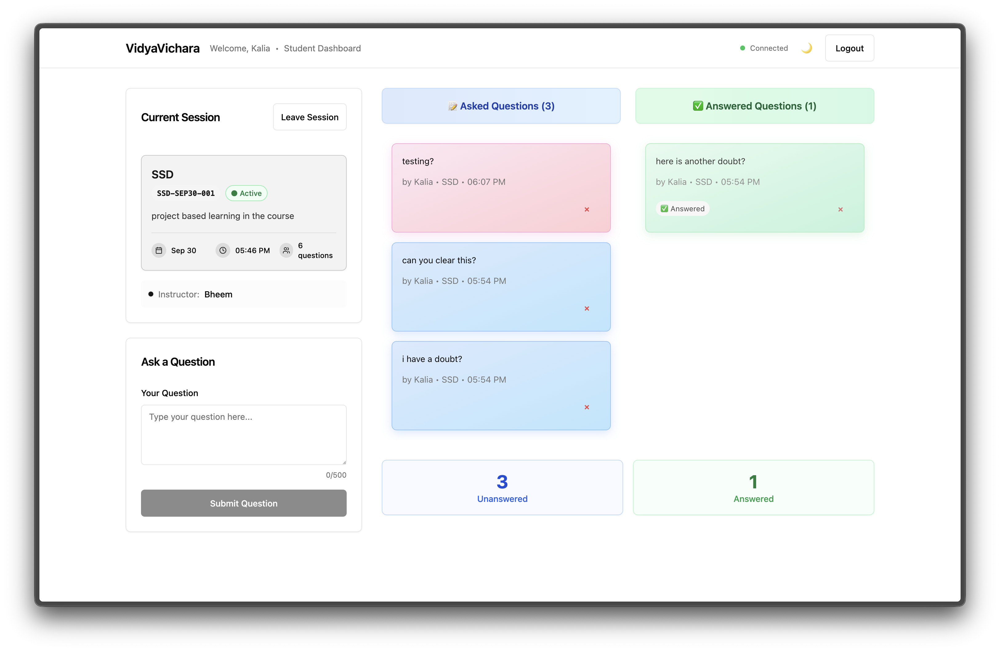

# VidyaVichara - Classroom Q&A Board

A real-time classroom Q&A application where students can post questions during lectures and instructors can view, organize, and respond to them in real-time.

Made with ❤️ by Team 25.

## Teacher's Dashboard



## Student's Dashboard



---

## Features

- **Real-time Q&A**: Students post questions instantly, teachers see them live
- **Session Management**: Teachers create and manage lecture sessions with human-readable IDs
- **Role-based Access**: Separate dashboards for students and teachers
- **Question Management**: Mark questions as important, answered, or delete them
- **PDF Export**: Teachers can export session summaries as PDF reports
- **Session Control**: Teachers can end sessions and clear questions
- **Real-time Updates**: Socket.io for instant synchronization across all users
- **Responsive Design**: Works seamlessly on mobile, tablet, and desktop
- **Dark/Light Theme**: Toggle between themes with ☀️/🌙 button

---

## How to get the project running

### 1. Clone and Install

```bash
# Install backend dependencies
cd backend
npm install

# Install frontend dependencies
cd ../frontend  
npm install
```

### 2. Environment Setup

**Backend Environment:**

```bash
cd backend
cp .env.example .env
# Edit .env with your MongoDB URI and JWT secret
```

**Frontend Environment:**

```bash
cd frontend
cp .env.example .env
# Edit .env if needed (defaults should work for local development)
```

### 3. Database Setup

Start MongoDB locally or ensure your MongoDB Atlas connection is ready. The application will automatically create the required collections.

```bash
# mongosh mongodb://localhost:27017/vidyavichara
```

### 4. Start the Application

**Start Backend (Terminal 1):**

```bash
cd backend
npm run dev
# Backend runs on http://localhost:3001
```

**Start Frontend (Terminal 2):**

```bash
cd frontend  
npm run dev
# Frontend runs on http://localhost:5173
```

### 5. Use the Application

1. Open <http://localhost:5173> in your browser
2. Register as either a Student or Teacher
3. **Students**: Submit questions for your lecture session
4. **Teachers**: Load a session to view and manage questions in real-time
